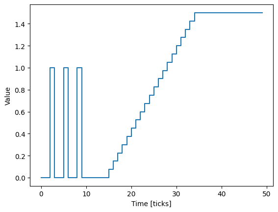

For example, a complex instruction can be created as follow:

.. code:: ipython2

    from caqtus.device.sequencer.instructions import (
        Pattern,
        Ramp,
        plot_instruction,
    )

    instr = (
        (Pattern([0]) * 2 + Pattern([1])) * 3
        + Pattern([0]) * 5
        + Ramp(0.0, 1.5, 20)
        + Pattern([1.5]) * 15
    )

This represent the following values over time:

.. code:: ipython2

    plot_instruction(instr);

